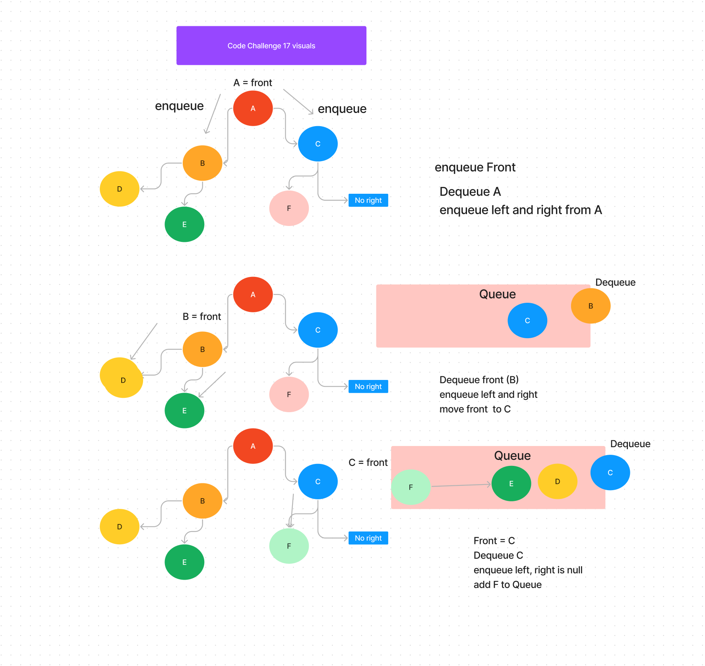

# Challenge 17
Write a function called breadth first
Arguments: tree
Return: list of all values in the tree, in the order they were encountered

### Whiteboard Process

### Approach & Efficiency
<!-- What approach did you take? Why? What is the Big O space/time for this approach? -->

### Solution
<!-- Show how to run your code, and examples of it in action -->

<!-- _______________________________________ -->

## code challenge 11

for this whiteboard I am supposed to have 2 stack, 1 to enqueue from, and a 2nd to dequeue from. The goal is for the two stacks together to act as a queue would.

### Whiteboard Process

### Approach & Efficiency
<!-- What approach did you take? Why? What is the Big O space/time for this approach? -->

