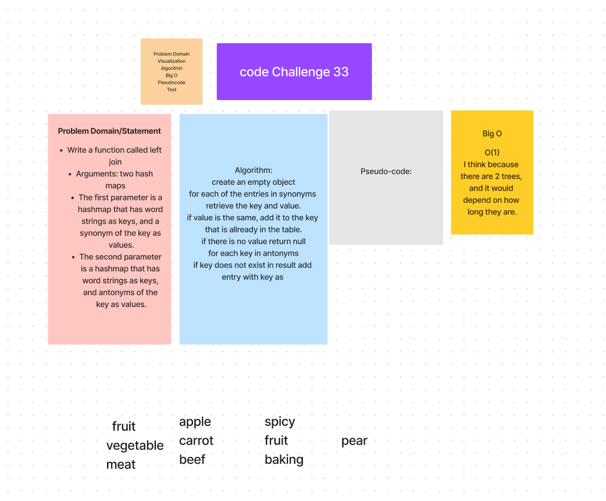

Write a function called left join
Arguments: two hash maps
The first parameter is a hashmap that has word strings as keys, and a synonym of the key as values.
The second parameter is a hashmap that has word strings as keys, and antonyms of the key as values.

# Challenge 33
Write a function called left join
Arguments: two hash maps
The first parameter is a hashmap that has word strings as keys, and a synonym of the key as values.
The second parameter is a hashmap that has word strings as keys, and antonyms of the key as values.

## Whiteboard Process

### Approach & Efficiency
<!-- What approach did you take? Why? What is the Big O space/time for this approach? -->
O(N), where N is the total number of times in the hash because it takes time to go through and compare. However, it is linear and will not effect time complexity.

### Solution

<!-- Show how to run your code, and examples of it in action -->
