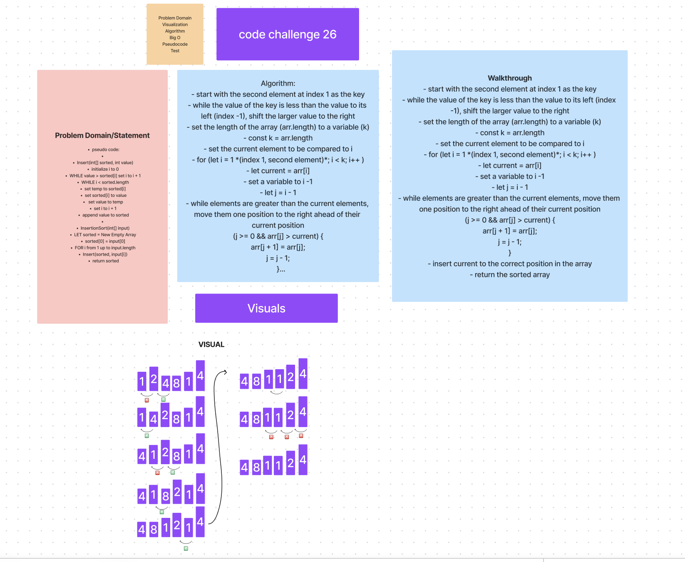

# Code Challenge 26

## Insert Function:

Initialize i to 0: This variable i will track the current position in the sorted subarray.
WHILE value > sorted[i]: This loop iterates through the sorted subarray until it finds an element smaller than or equal to the value being inserted.
set i to i + 1: This statement increases the index to the next element in the sorted subarray.
WHILE i < sorted.length: This loop iterates through the remaining elements of the sorted subarray, shifting them to make room for the new value.
set temp to sorted[i]: This statement stores the current element in a temporary variable.
set sorted[i] to value: This statement replaces the current element with the value being inserted.
set value to temp: This statement moves the previously stored element to the value variable.
set i to i + 1: This statement increments the index to process the next element.
append value to sorted: Finally, the value is added to the end of the sorted subarray.
InsertionSort Function:

LET sorted = New Empty Array: This creates an empty array to store the sorted elements.
sorted[0] = input[0]: The first element of the input array is copied to the sorted array.
FOR i from 1 up to input.length: This loop iterates through each element in the input array starting from the second element.
Insert(sorted, input[i]): The Insert function is called for each element, placing it in its correct position within the sorted subarray.
return sorted: Finally, the sorted array is returned.

## Whiteboard Process

