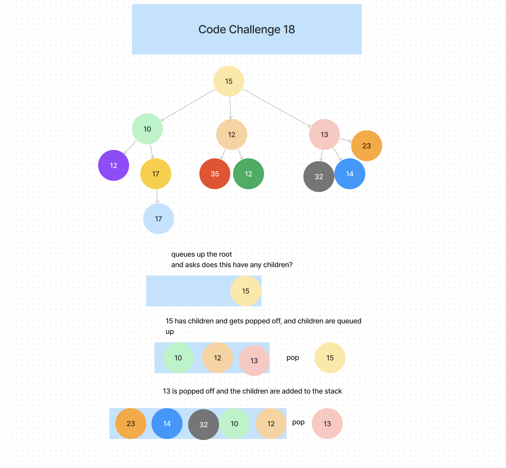

# Challenge 18

Write a function called fizz buzz tree
Arguments: k-ary tree
Return: new k-ary tree
Determine whether or not the value of each node is divisible by 3, 5 or both. Create a new tree with the same structure as the original, but the values modified as follows:

If the value is divisible by 3, replace the value with “Fizz”
If the value is divisible by 5, replace the value with “Buzz”
If the value is divisible by 3 and 5, replace the value with “FizzBuzz”
If the value is not divisible by 3 or 5, simply turn the number into a String.

## Whiteboard Process

### Approach & Efficiency
<!-- What approach did you take? Why? What is the Big O space/time for this approach? -->
O(N), where N is the total number of nodes in the original tree because it takes time to traverse the tree. However, it is linear and will not effect time complexity.

### Solution

<!-- Show how to run your code, and examples of it in action -->
