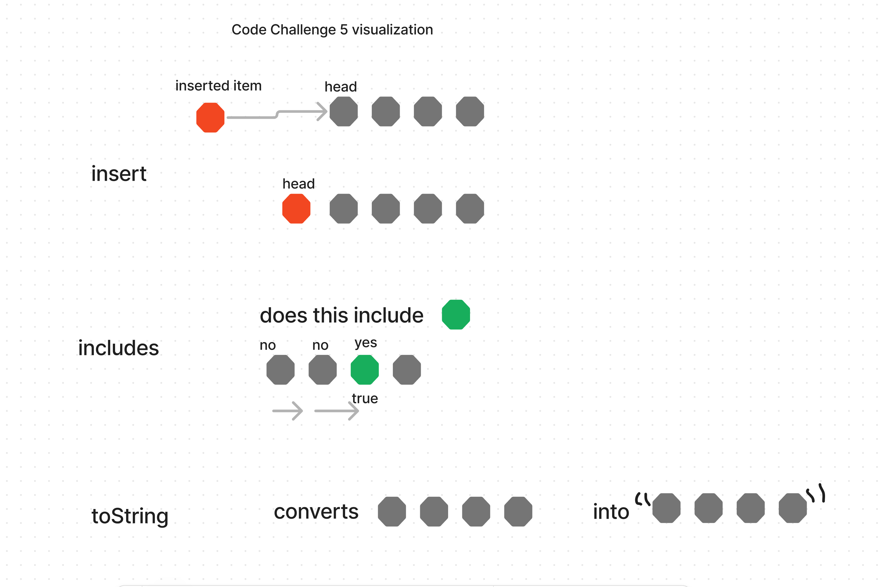

# Challenge 5
Node
Create a Node class that has properties for the value stored in the Node, and a pointer to the next Node.
Linked List
Create a Linked List class
Within your Linked List class, include a head property.
Upon instantiation, an empty Linked List should be created.
The class should contain the following methods
insert
Arguments: value
Returns: nothing
Adds a new node with that value to the head of the list with an O(1) Time performance.
includes
Arguments: value
Returns: Boolean
Indicates whether that value exists as a Node’s value somewhere within the list.
to string
Arguments: none
Returns: a string representing all the values in the Linked List, formatted as:
"{ a } -> { b } -> { c } -> NULL"

### Whiteboard Process

### Approach & Efficiency
<!-- What approach did you take? Why? What is the Big O space/time for this approach? -->
I mostly followed along in class.

### Solution
<!-- Show how to run your code, and examples of it in action -->
npm test linkedList

<!-- _______________________________________ -->

## code challenge 11

for this whiteboard I am supposed to have 2 stack, 1 to enqueue from, and a 2nd to dequeue from. The goal is for the two stacks together to act as a queue would.

### Whiteboard Process

### Approach & Efficiency
<!-- What approach did you take? Why? What is the Big O space/time for this approach? -->
npm test stackQueuePseudo