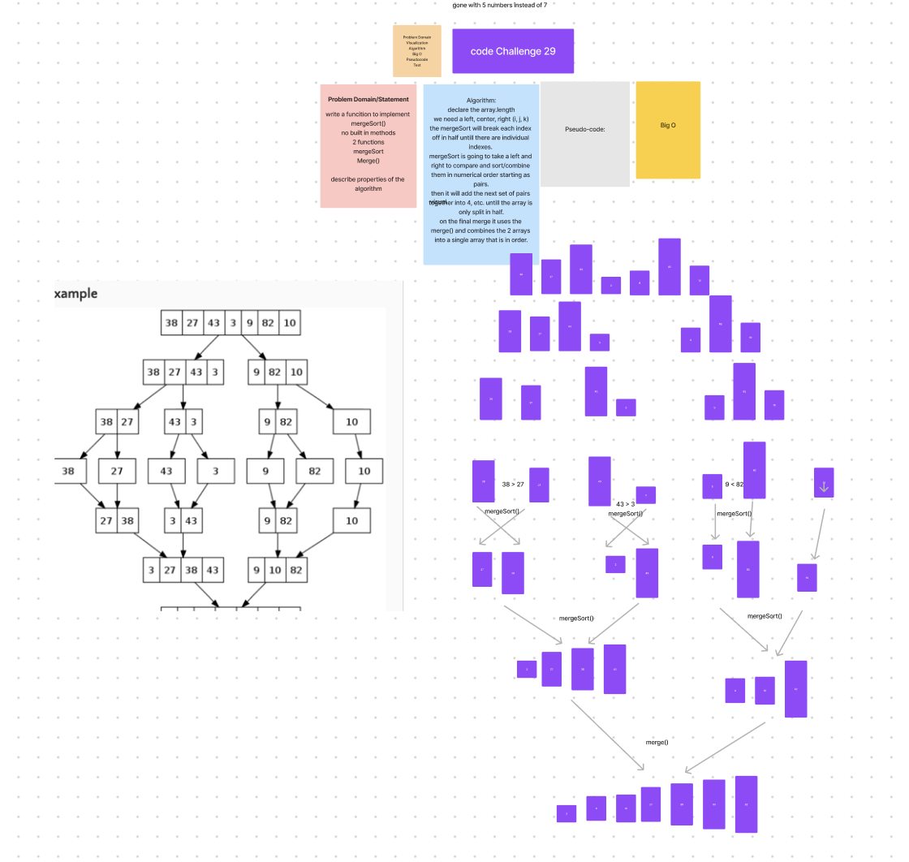

# Merge Sort blog

Merge sort is a divide-and-conquer algorithm that efficiently sorts an array. It works by recursively breaking down an unsorted array into smaller subarrays until they are individually sorted, and then merging these sorted subarrays back together to create the final sorted array.

Consider the sample array: [8, 4, 23, 42, 16, 15]

Step-by-Step Demonstration

Divide the array into two halves: [8, 4], [23, 42, 16, 15].

Recursively sort the left and right halves:
a. Sort the left half: [8, 4] -> [4, 8].
b. Sort the right half: [23, 42, 16, 15] -> [15, 16, 23, 42].

Merge the sorted left and right halves into the final sorted array:
a. Compare 4 and 15: Move 15 to the final sorted array and update indexes.
b. Compare 8 and 16: Move 16 to the final sorted array and update indexes.
c. Compare 8 and 23: Move 23 to the final sorted array and update indexes.
d. Compare 4 and 42: Move 42 to the final sorted array and update indexes.
e. Compare 8 and no more elements: Move 8 to the final sorted array.

Final Sorted Array: [4, 8, 15, 16, 23, 42].

