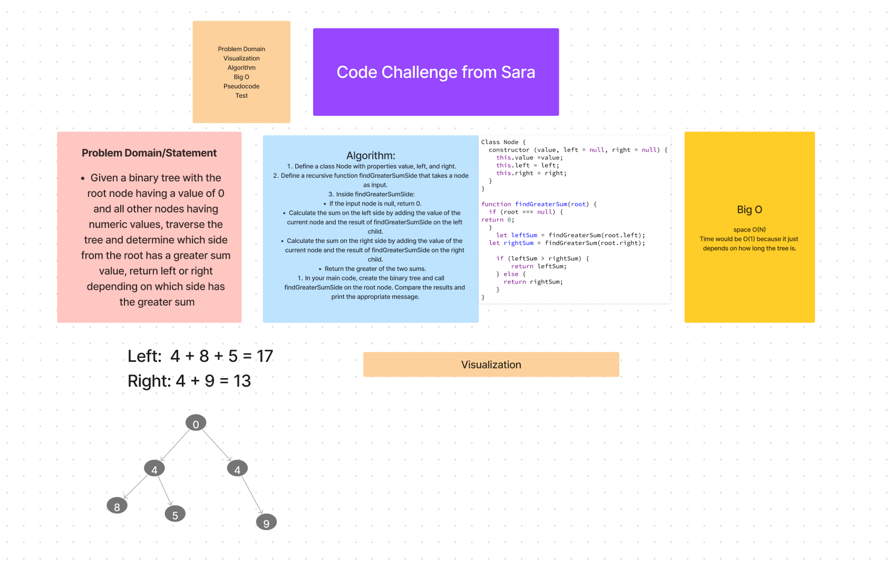

# Challenge 37
Given a binary tree with the root node having a value of 0 and all other nodes having numeric values, traverse the tree and determine which side from the root has a greater sum value, return left or right depending on which side has the greater sum

### Whiteboard Process

