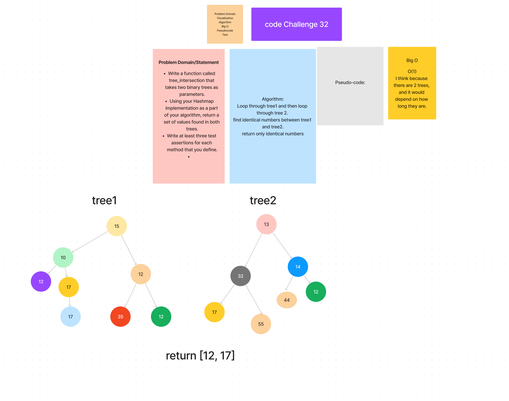

# code challenge 31

## Whiteboard Process

### Approach & Efficiency
<!-- What approach did you take? Why? What is the Big O space/time for this approach? -->
O(1),I think because there are 2 trees, and it would depend on how long they are.

### Solution
jest whiteboard/treeIntersection/treeInters.test.js
<!-- Show how to run your code, and examples of it in action -->